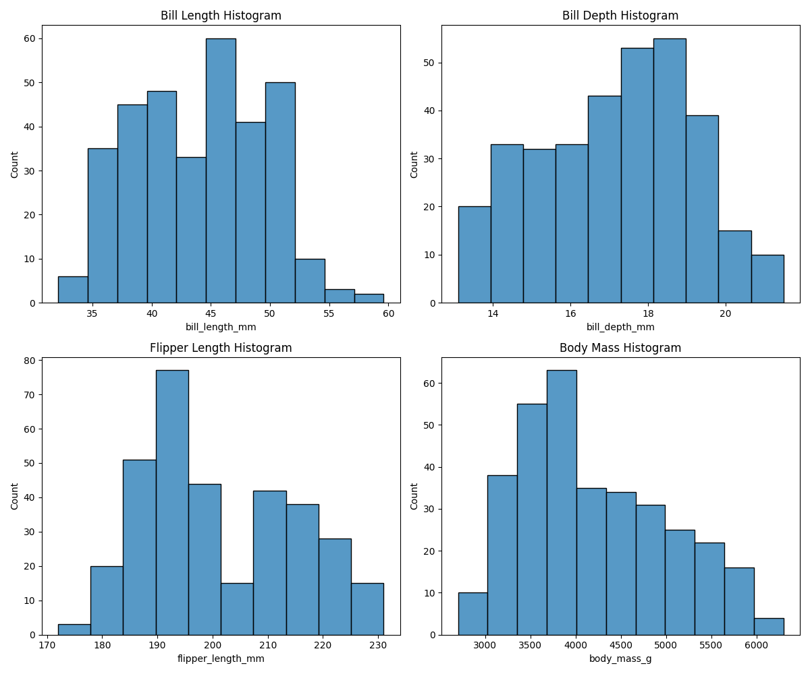
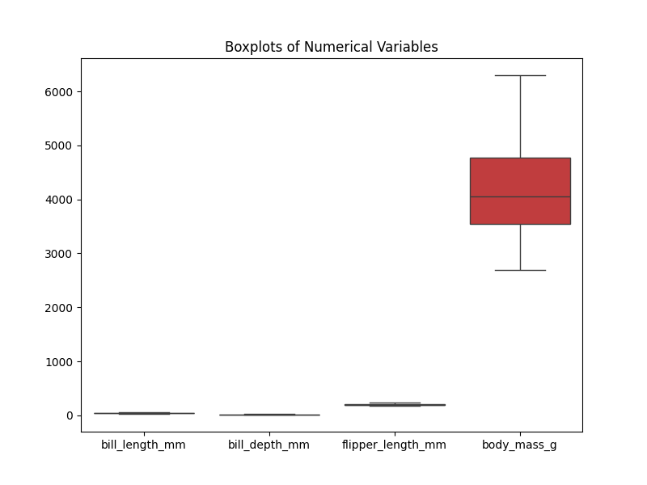
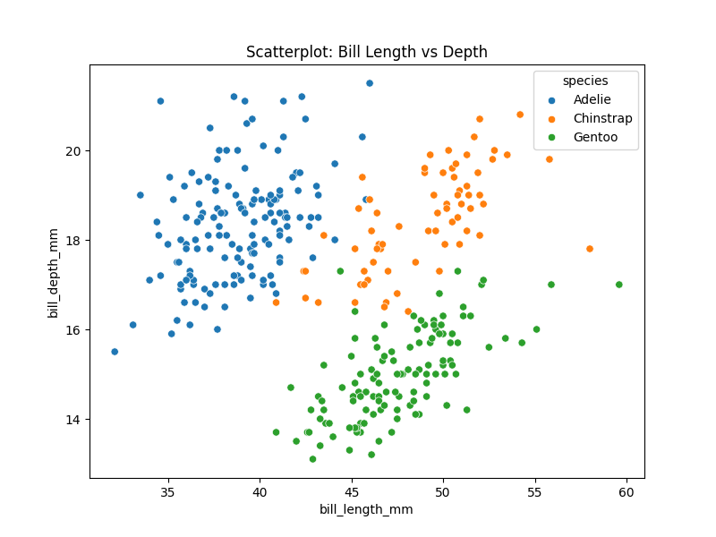
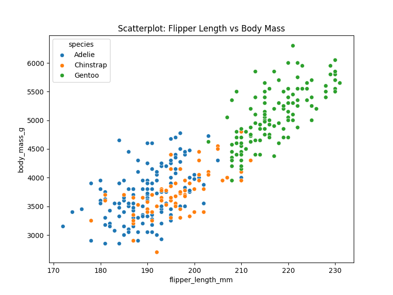
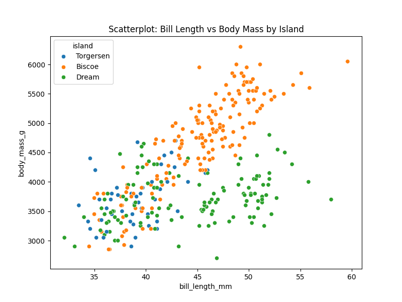
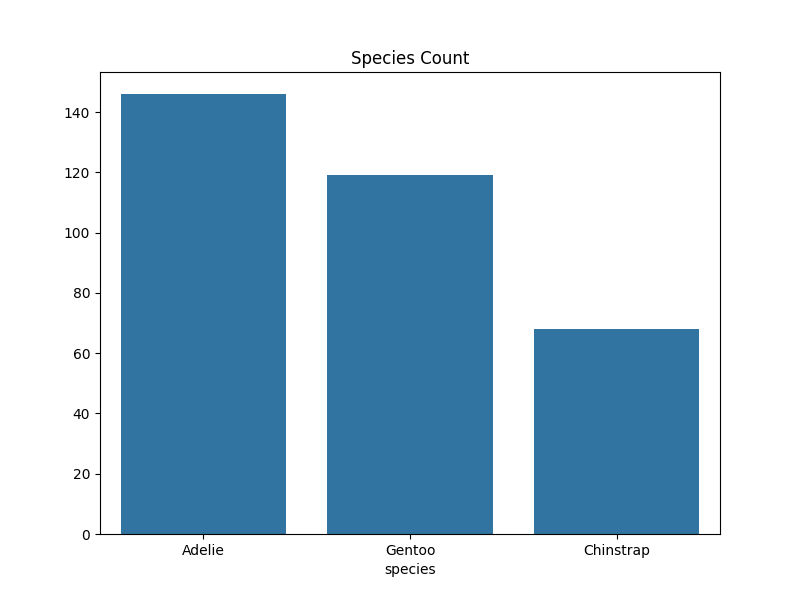
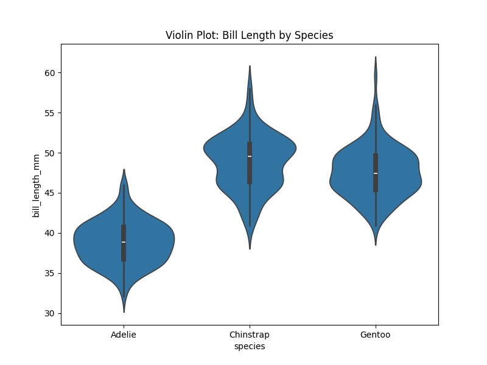
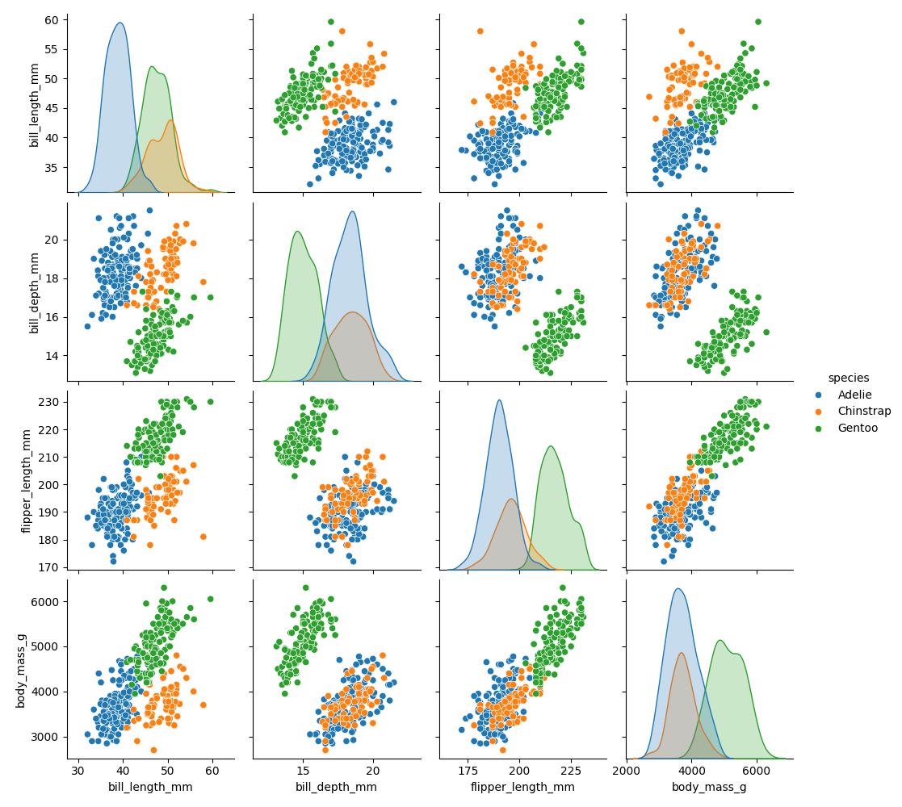
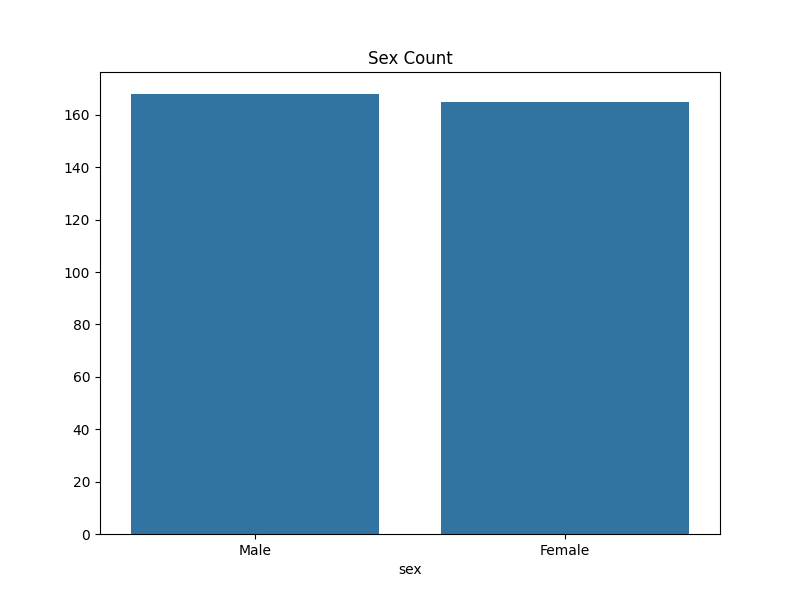

# 펭귄 데이터셋 분석 슬라이드

---

## 타이틀 슬라이드

**펭귄 데이터셋 분석 보고서**

- 분석자: GitHub Copilot
- 날짜: 2025년 12월 23일
- 데이터: Palmer Penguins Dataset

---

## 소개

펭귄 데이터셋은 남극의 세 섬에서 수집된 Adelie, Chinstrap, Gentoo 세 종의 펭귄 데이터를 포함합니다.

- 변수: 종, 섬, 부리 길이/깊이, 날개 길이, 체중, 성별
- 목적: 생태적 다양성 분석 및 시각화

---

## 데이터 개요

| 종       | 섬          | 부리 길이 (mm) | 부리 깊이 (mm) | 날개 길이 (mm) | 체중 (g) | 성별   |
|----------|-------------|----------------|----------------|----------------|----------|--------|
| Adelie   | Torgersen  | 39.1          | 18.7          | 181           | 3750    | Male   |
| Adelie   | Torgersen  | 39.5          | 17.4          | 186           | 3800    | Female |
| ...      | ...        | ...           | ...           | ...           | ...     | ...    |

**인사이트:** 데이터는 생물 다양성을 연구하는 데 유용하며, 결측치가 일부 존재합니다.

---

## 기술 통계

|       | 부리 길이 | 부리 깊이 | 날개 길이 | 체중   |
|-------|-----------|-----------|-----------|--------|
| 평균  | 43.99    | 17.16    | 200.97   | 4207.06 |
| 표준편차 | 5.47     | 1.97     | 14.02    | 805.22 |
| 최소  | 32.1     | 13.1     | 172      | 2700   |
| 최대  | 59.6     | 21.5     | 231      | 6300   |

**인사이트:** 체중의 변이가 크며, 종별 차이가 예상됩니다.

---

## 히스토그램

**인사이트:** 부리 길이와 깊이는 정규분포에 가까우며, Gentoo의 큰 체구가 영향을 미칩니다.

---

## 박스플롯

**인사이트:** 체중의 분산이 가장 크며, 이상치를 조사할 필요가 있습니다.

---

## 산점도 1: 부리 길이 vs 깊이

**인사이트:** 종별 군집이 명확하며, 먹이 습성과 관련될 수 있습니다.

---

## 산점도 2: 날개 길이 vs 체중

**인사이트:** 강한 양의 상관관계로, 수영 능력을 반영합니다.

---

## 산점도 3: 부리 길이 vs 체중 (섬별)

**인사이트:** 섬의 환경이 펭귄 크기에 영향을 미칩니다.

---

## 바 차트: 종별 개수

**인사이트:** Gentoo가 가장 많으며, 데이터 불균형을 고려해야 합니다.

---

## 교차표: 종 vs 섬

| 종       | Biscoe | Dream | Torgersen |
|----------|--------|-------|-----------|
| Adelie   | 44     | 55    | 47        |
| Chinstrap| 0      | 68    | 0         |
| Gentoo   | 119    | 0     | 0         |

**인사이트:** 종별 서식지가 분리되어 있습니다.

---

## 피봇 테이블: 평균 체중 (종 x 성별)

| 종       | Female | Male  |
|----------|--------|-------|
| Adelie   | 3368.84| 4043.49 |
| Chinstrap| 3527.21| 3938.97 |
| Gentoo   | 4679.74| 5484.84 |

**인사이트:** 수컷이 더 무겁습니다. 성적 이형성입니다.

---

## 바이올린 플롯 1: 부리 길이

**인사이트:** Gentoo의 부리가 큽니다.

---

## 바이올린 플롯 2: 체중

**인사이트:** 체중 분포가 종별로 다릅니다.

---

## 페어플롯

**인사이트:** 다변량 관계를 보여줍니다.

---

## 상관 히트맵

**인사이트:** 날개 길이와 체중의 상관이 높습니다.

---

## 카운트 플롯: 섬별 종

**인사이트:** 섬별 환경이 종 선택에 영향을 미칩니다.

---

## 바 차트: 성별 개수

**인사이트:** 성비가 균형적입니다.

---

## 교차표: 성별 vs 종

| 성별   | Adelie | Chinstrap | Gentoo |
|--------|--------|-----------|--------|
| Female | 73     | 34        | 58     |
| Male   | 73     | 34        | 61     |

**인사이트:** 각 종에서 성비가 비슷합니다.

---

## 피봇 테이블: 평균 날개 길이 (섬 x 종)

| 섬       | Adelie | Chinstrap | Gentoo |
|----------|--------|-----------|--------|
| Biscoe   | 188.8  | nan       | 217.2  |
| Dream    | 189.9  | 195.8     | nan    |
| Torgersen| 191.5  | nan       | nan    |

**인사이트:** Gentoo의 날개가 가장 깁니다.

---

## 결론

- 펭귄 데이터셋 분석 완료
- 13개 그래프와 4개 테이블 생성
- 종별, 섬별, 성별 차이 발견
- 생태적 의미: 환경 적응과 진화

---

## 참고 자료

- 데이터 출처: seaborn.load_dataset('penguins')
- 도구: Python, pandas, seaborn, matplotlib, pandoc